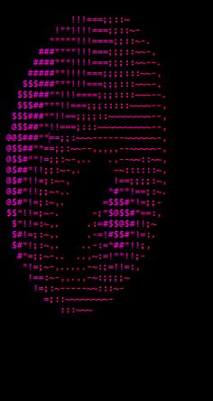
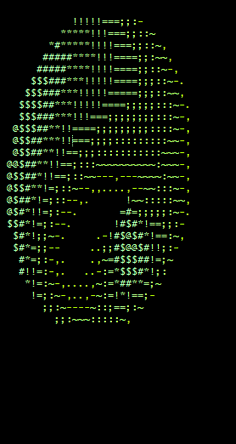
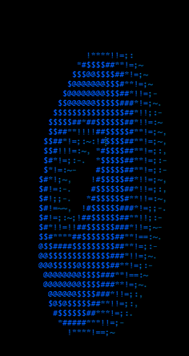

## Spinning Donut

  

Here is my implementation of the [Spinning Donut](https://www.a1k0n.net/2011/07/20/donut-math.html) written in :snake:. To make it more meaningfull in terms of art (it's an **ASCII ART** :trollface: ) I've added some basic colours support. These colours were taken from **8-bit** escape characters table. By default the donut will be rendered with default terminal settings. To render the donut with different colour than default one just run the script with given option:

```
options:
  -h, --help                               show this help message and exit
  -c ['pink', 'magenta', 'green', 'blue']  Colours palette
```

### References

1. https://www.a1k0n.net/2011/07/20/donut-math.html
2. https://en.wikipedia.org/wiki/ANSI_escape_code
